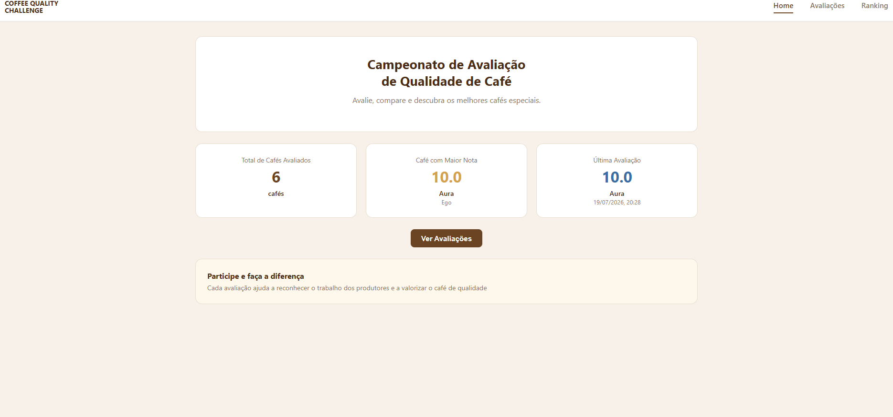
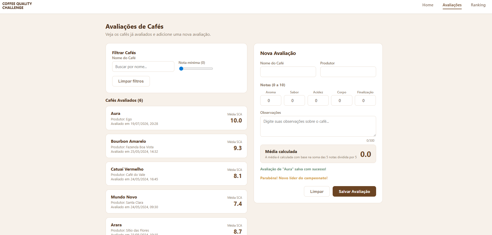
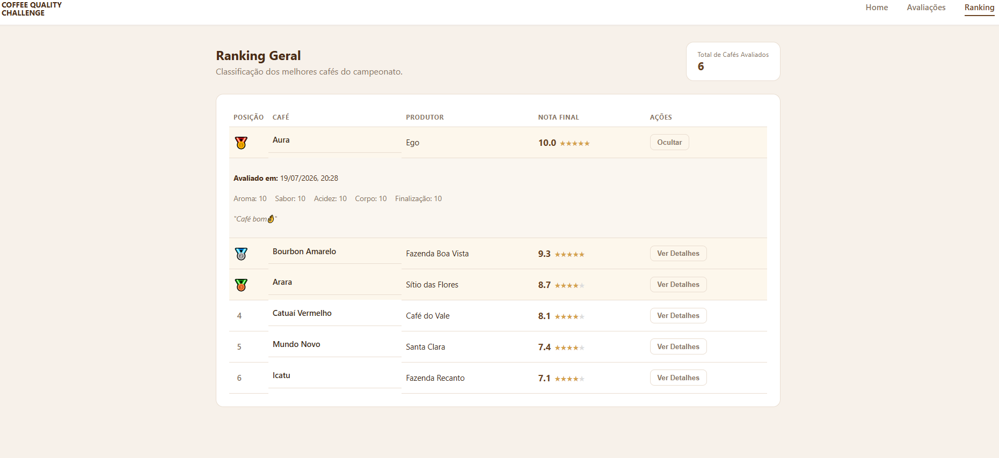

##  Prints das 3 telas 
  ** 

  ** 

  ** 


## Onde cada conceito utilizado foi utilizado


### Templates 
- **`v-for`:** listagem de cafés em `Avaliacoes.vue` (`<CoffeeCard v-for="cafe in cafesFiltrados">`),
  linhas do ranking em `LeaderboardTable.vue`, estrelas de avaliação.
- **`v-if` / `v-else`:** mensagens condicionais como "Nenhum café avaliado ainda"
  (`Avaliacoes.vue`, `LeaderboardTable.vue`), "Parabéns! Novo líder do campeonato!"
  e mensagens de erro/sucesso em `RatingForm.vue`.

### Reatividade 
- `store/coffees.js` usa `reactive([...])` para a lista de cafés — qualquer alteração
  (nova avaliação) atualiza automaticamente Home, Avaliações e Ranking.
- `RatingForm.vue` usa `ref()` para cada campo do formulário e um `computed()`
  (`mediaCalculada`) que recalcula a média SCA **em tempo real**, a cada tecla digitada.
- `Home.vue` e `Ranking.vue` consomem `computed()` (`totalAvaliados`, `cafeComMaiorNota`,
  `ultimaAvaliacao`, `ranking`) que se atualizam sozinhos sempre que o estado global muda.

### Listas 
- O array reativo `coffees` (em `store/coffees.js`) recebe novos itens via `push()`
  dentro de `adicionarAvaliacao()`.
- `LeaderboardTable.vue` renderiza dinamicamente a lista ordenada (`ranking`) com `v-for`,
  incluindo estado individual por linha (detalhe expandido) controlado por `ref`.
- `CoffeeFilter.vue` permite filtrar a lista renderizada (por nome e nota mínima) sem
  alterar os dados originais.

### Componentes 

- `CoffeeCard.vue` — recebe `coffee` via `props` e exibe nome, produtor, nota e data.
- `RatingForm.vue` — formulário de avaliação, comunica-se com o estado global via
  o composable `useCoffeesStore()`.
- `LeaderboardTable.vue` — recebe `cafes` via `props` e exibe a tabela de ranking com
  medalhas para os 3 primeiros colocados.
- `CoffeeFilter.vue` (opcional) — emite eventos (`emit('filtrar', ...)`) para o
  componente pai (`Avaliacoes.vue`) através de comunicação por eventos customizados.

### Rotas 
Configuradas em `src/router/index.js`:
- `/` (com redirecionamento de `/home`) → `Home.vue`
- `/avaliacoes` → `Avaliacoes.vue`
- `/ranking` → `Ranking.vue`

A navegação é feita pela navbar em `App.vue` usando `<RouterLink>`, e também
tem como com `useRouter().push('/avaliacoes')` no botão "Ver Avaliações"
da Home.

##  Cálculo da média 

```
Média = (Aroma + Sabor + Acidez + Corpo + Finalização) / 5
```

Implementado em `calcularMedia()` (`store/coffees.js`) e replicado como `computed()`
em `RatingForm.vue` para exibir a atualização em tempo real antes de salvar.
